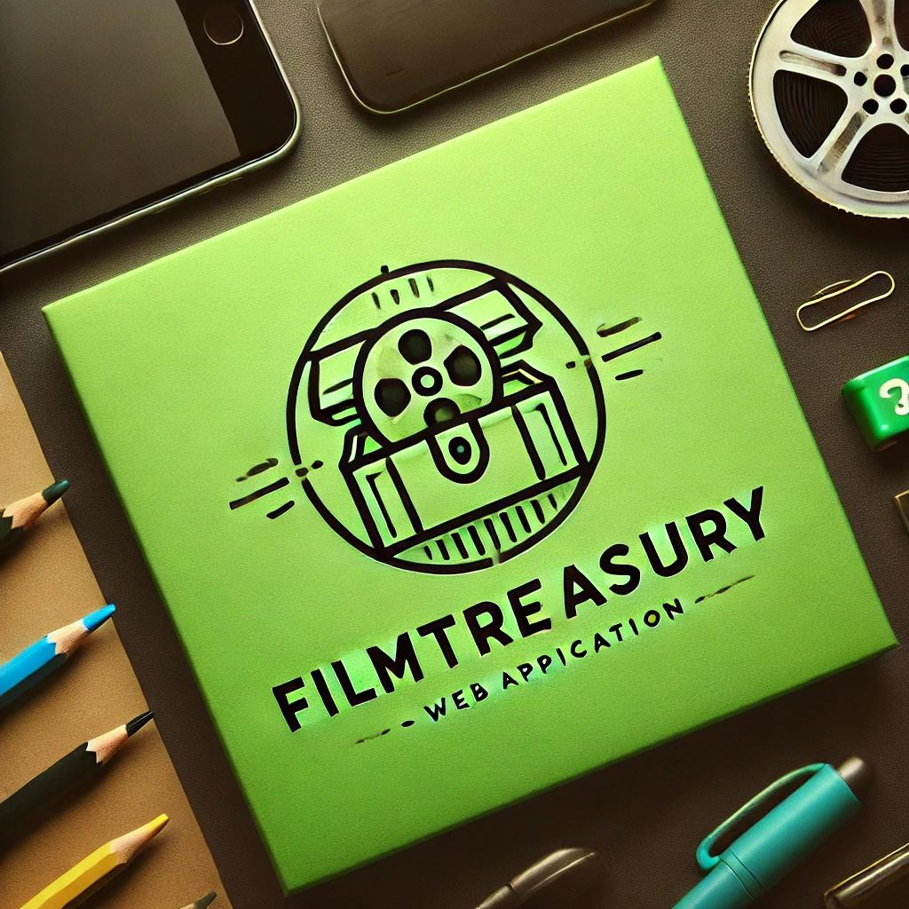

  

# FilmTreasury
¡Bienvenidos a **FilmTreasury**! Este proyecto es una aplicación web para gestionar y descubrir películas, con funcionalidades como soporte al usuario, inicio de sesión y un listado de películas recientes añadidas por amigos.

## **Índice**
1. [Descripción del Proyecto](#descripción-del-proyecto)
2. [Características Principales](#características-principales)
3. [Guía de Estilo](#guía-de-estilo)
4. [Historias de Usuario](#historias-de-usuario)
5. [Tecnologías Utilizadas](#tecnologías-utilizadas)
6. [Autor](#autor)

---

## **Descripción del Proyecto**

FilmTreasury es una plataforma de gestión de películas que permite a los usuarios ver qué películas han añadido sus amigos recientemente, gestionar su lista de películas favoritas y acceder a soporte técnico. También incluye una interfaz de usuario intuitiva con componentes como el inicio de sesión, soporte y detalles de películas.

## **Características Principales**

- Inicio de sesión con correo y Google.
- Listado de películas recientes añadidas por los amigos.
- Formulario de contacto para soporte.
- Diseño responsivo adaptado a dispositivos móviles.
- Interfaz centrada en la experiencia del usuario.

## **Guía de Estilo**

La interfaz de **FilmTreasury** sigue una guía de estilo bien definida para mantener la coherencia visual en todas las páginas. A continuación, se destacan algunos puntos clave:

- **Colores Principales:**
  - Fondo: `#21201e` (gris oscuro)
  - Texto: `#ebe8ff` (blanco) y `#42ab47` (verde para botones/enlaces)
  
- **Tipografía:**
  - Fuente Principal: `Prosto One`
  - Tamaños: Encabezado `36px`, Texto Párrafo `16px`, Botones `16px`.

Puedes consultar la **Guía de Estilo** completa en el archivo [guia-de-estilo.md](./guia-de-estilo.md) en este repositorio.

## **Historias de Usuario**

El proyecto sigue un enfoque basado en historias de usuario para asegurar que se cumplan las necesidades del usuario final. Aquí algunos ejemplos:

1. **Registro de Usuario:**  
   Como usuario nuevo, quiero registrarme en la plataforma para gestionar mi colección de películas.

2. **Listado de Películas Recientes:**  
   Como usuario, quiero ver las películas añadidas recientemente por mis amigos para descubrir nuevas opciones de visualización.

Puedes ver más detalles en el archivo [guia-de-estilo.md](./guia-de-estilo.md).

## **Tecnologías Utilizadas**

- **Frontend:**
  - HTML5
  - CSS3 (con Flexbox y Grid)
  - JavaScript

- **Backend:**
  - Actualmente no disponible en esta versión del proyecto.

- **Dependencias:**
  - Google Fonts (Prosto One)
  - Iconos SVG

## **Autor**

Este proyecto ha sido desarrollado por **Francisco Salapic** como parte de una tarea académica.  